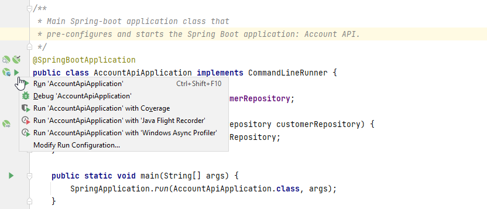
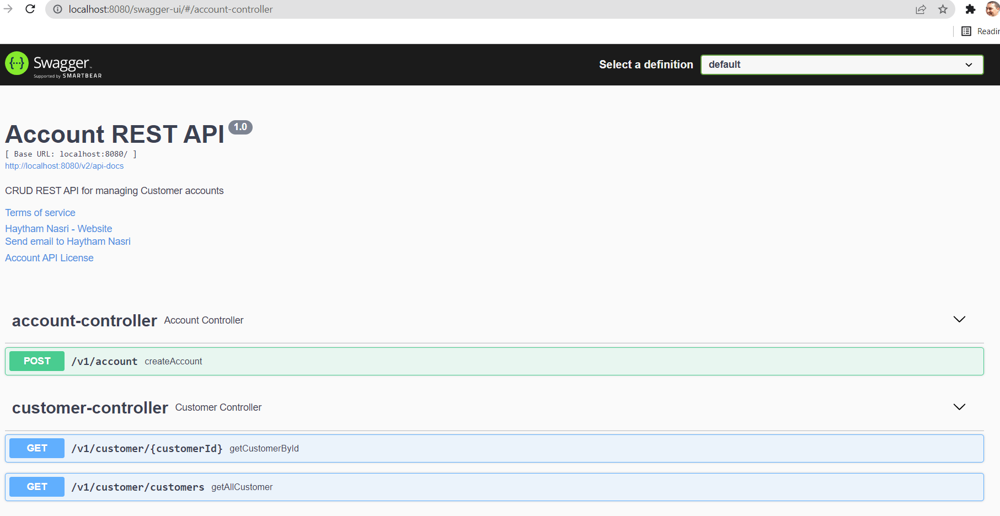

# Getting Started

The project consists of an API to be used for opening a new “current account” of already existing  customers.
# Requirements
* The API will expose an endpoint which accepts the user information (customerID,
initialCredit).
* Once the endpoint is called, a new account will be opened connected to the user whose ID is
customerID.
* Also, if initialCredit is not 0, a transaction will be sent to the new account.
* Another Endpoint will output the user information showing Name, Surname, balance, and
transactions of the accounts.

* Accounts and Transactions are different services.

# Constraints
For storing the information, the data can be saved in memory and not actually persisted to an
external database, so that the solution can be easily used and tested. 

### Reference Documentation

For further reference, please consider the following sections:

* [Official Apache Maven documentation](https://maven.apache.org/guides/index.html)
* [Spring Boot Maven Plugin Reference Guide](https://docs.spring.io/spring-boot/docs/2.6.4/maven-plugin/reference/html/)
* [Create an OCI image](https://docs.spring.io/spring-boot/docs/2.6.4/maven-plugin/reference/html/#build-image)
* [Spring Boot DevTools](https://docs.spring.io/spring-boot/docs/2.6.4/reference/htmlsingle/#using-boot-devtools)
* [Spring Configuration Processor](https://docs.spring.io/spring-boot/docs/2.6.4/reference/htmlsingle/#configuration-metadata-annotation-processor)

## General technical information ##

#### 1.1. Techniques
Core set of used techniques:

`Java 1.8` `Springboot` `REST` `Maven` `Spring Data JPA` `H2` `JUnit 5` `Mockito`

 

# Developers information #

## Local run and debugging ##

This project is a Spring Boot application. It can be started locally by running `mvn spring-boot:run`
OR alternatively you can use the start icon in the main application:

Debugging can be done by starting the application with the following command:
`mvn spring-boot:run -Dspring-boot.run.jvmArguments="-Xdebug -Xrunjdwp:transport=dt_socket,server=y,suspend=y,address=5005"`
Intellij remote debugger can now be connected on `port 5005`.
Source:
- https://www.baeldung.com/spring-debugging
  Or alternatively you can hit the debug button from the main application, as shown in the screenshot above.

**The application is accessible via web browser:**
- http://localhost:8080/

**The OpenAPI (Swagger) API definition is accessible via web browser:**
- http://localhost:8080/swagger-ui/

## Hot Swapping ##
Since Spring Boot applications are just plain Java applications, JVM hot-swapping should work out of the box.
JVM hot swapping is somewhat limited with the bytecode that it can replace. For a more complete solution, JRebel can be used.

 

